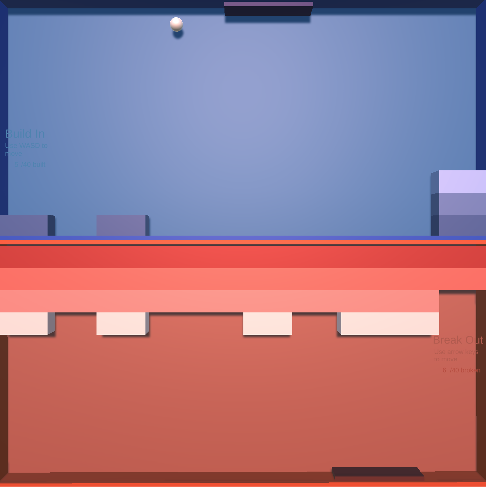
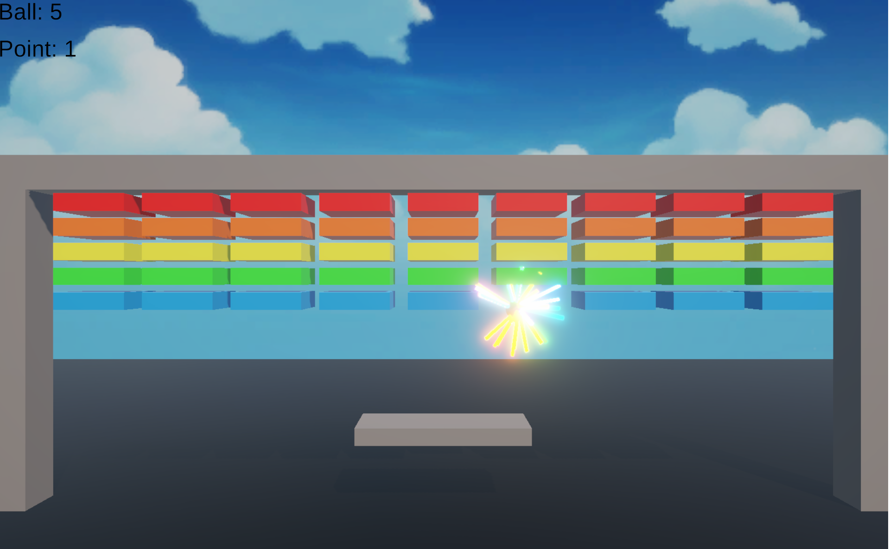
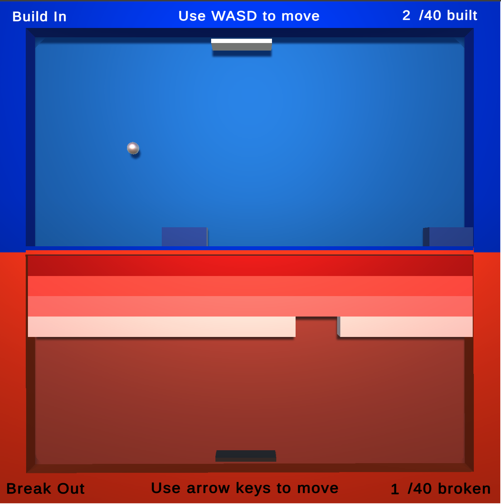
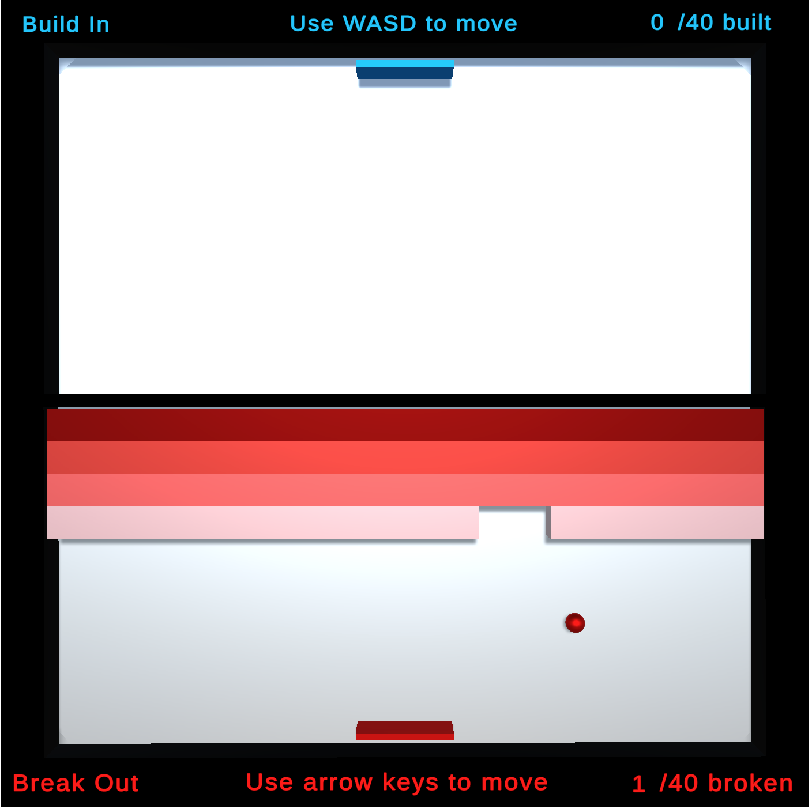
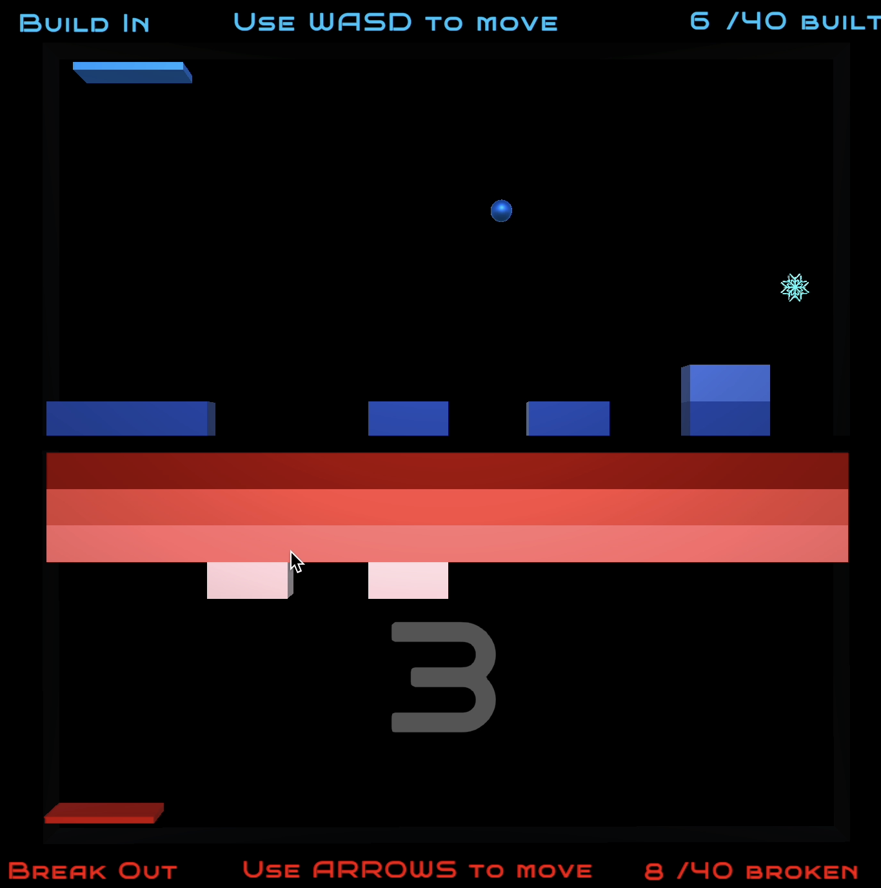

# Breakout Reflection - Ashlyn McClendon

### 1. breakout-1: [Play here](http://ashlyn-mcc.github.io/game-dev-spring2025/builds/breakout-1) 

For this prototype I was experimenting with ways to make breakout unique. I came up with the idea to invert "breakout" into "buildin". The prototype I came up with for this phase was functionally poor. In class I got the feedback that A. My demo was buggy and the ball was getting lost off screen and behind bricks and B. The paddle offered no real control over the ball. The gameplay of this version was bad, but I had created a solid foundation of scripts and game objects. They just needed to be dubugged and fine tuned. With this prototype I learned how to use 2D arrays to hold my game objects (the bricks) and how to apply my own forces to the game objects (the paddle and ball).

### 2a. breakout-2a [Play here](http://ashlyn-mcc.github.io/game-dev-spring2025/builds/breakout-2a)

I worked with Dayeon for this assignment. We came together to build off of each of our breakout-1 prototypes. For the 2a version we built off of hers. The main things we played around with were adding bounds so the paddle doesn't go off screen, particle emitters to indicate the destruction of a block, and increasing the velocity of the ball as it hits higher up bricks.

### 2b. breakout - 2b [Play here](http://ashlyn-mcc.github.io/game-dev-spring2025/builds/breakout-2b)

This one built off of my original one. With this prototype I wanted to experiment with creating a gameplay that felt intentional. We fixed the code so the ball stopped getting lost off screen and behind bricks. I learned that using collisions worked better than triggers so we made the switch. We also altered the paddle scripts so they take into account the angle at which the ball hit and alters it's angular velocity accordingly. I also went back and revamped the visuals to be a bit cleaner and added sound effects and a game over screen. In class I got the feedback that the gameplay felt better, but the game doesn't feel competitive. People suggested that I add powerups to help players who get them or hurt their opponents.

### 3. breakout-3 [Play here](http://ashlyn-mcc.github.io/game-dev-spring2025/builds/breakout-3)

For this prototype I was experimenting with making the game more competitve and allowing each side to sabotage the other. To do this I added two different powerups. The first is the ability to freeze the other player's ball. At random increments a snowflake will fall across the player's screens. If the player collides with the snowflake the other player's ball becomes immobilized for five seconds. The second power up I added was the ability to reverse the other player's progress. When a player clears a row of their bricks (or builds one in) it finds five of the other player's columns with the most progress and undoes it. For the breakout player, this means it breaks 5 of the buildin players bricks. For the buildin player, this means it builds 5 of the breakout players bricks. The last thing I added to this iteration was a game over screen to indicate which player won. This iteration made me get really comfortable with scripting with 2D arrays. It was challenging figuring out how to get access to the other player's scripts and bricks and reverse their progress. I wasn't in class to get any feedback from playtesters, but I played it with some of my friends. They gave the feedback that it wasn't aways clear what was happening and maybe I should make it more clear that the other players ball was frozen, or their progress was undone, or indicate how much time a player has before they respawn. I obviously know what's happening since i know the code, but it was a helpful reminder that people looking at it without seeing the scripts aren't going to know what is happening. You have to show it visually. 

### 4. breakout-final [Play here](http://ashlyn-mcc.github.io/game-dev-spring2025/builds/breakout-final)

For my final prototype I focus on polish. One thing I wanted to do was signal to the player the changes that were happening in the game. The respawn timer gets 1 second bigger each time you go out of bounds. Therefore, the amount of time you're waiting for a new ball varies and increases over the course of the game. I added a timer that appears on the player's screen indicating how long until they get another ball so the player isn't aimlessly waiting. I tweaked the visuals again and added some fonts for polish. This iteration made me think about approaching my game as a player, not a developer. I obviosuly know all the ins and outs of what's happening, but I needed to step back and imagine I was seeing it for the first time. 