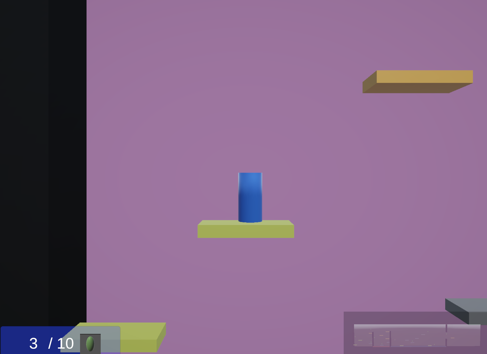

# Platformer Reflection - Ashlyn McClendon

### 1. Platformer Round 1: [Play here](http://ashlyn-mcc.github.io/game-dev-spring2025/builds/breakout-1) 

For this prototype I was experimenting with ways to make breakout unique. I came up with the idea to invert "breakout" into "buildin". The prototype I came up with for this phase was functionally poor. In class I got the feedback that A. My demo was buggy and the ball was getting lost off screen and behind bricks and B. The paddle offered no real control over the ball. The gameplay of this version was bad, but I had created a solid foundation of scripts and game objects. They just needed to be dubugged and fine tuned. With this prototype I learned how to use 2D arrays to hold my game objects (the bricks) and how to apply my own forces to the game objects (the paddle and ball).

### 2a. Platformer Round 2 [Play here](http://ashlyn-mcc.github.io/game-dev-spring2025/builds/breakout-2a)

I worked with Dayeon for this assignment. We came together to build off of each of our breakout-1 prototypes. For the 2a version we built off of hers. The main things we played around with were adding bounds so the paddle doesn't go off screen, particle emitters to indicate the destruction of a block, and increasing the velocity of the ball as it hits higher up bricks. I showed our other prototype in class, but I thought that she could further iterate on this one by adding different levels and brick formations.

### 2b. Platformer Final Round [Play here](http://ashlyn-mcc.github.io/game-dev-spring2025/builds/breakout-2b)

This one built off of my original one. With this prototype I wanted to experiment with creating a gameplay that felt intentional. We fixed the code so the ball stopped getting lost off screen and behind bricks. I learned that using collisions worked better than triggers so we made the switch. We also altered the paddle scripts so they take into account the angle at which the ball hit and alters it's angular velocity accordingly. I also went back and revamped the visuals to be a bit cleaner and added sound effects and a game over screen. In class I got the feedback that the gameplay felt better, but the game doesn't feel competitive. People suggested that I add powerups to help players who get them or hurt their opponents.
