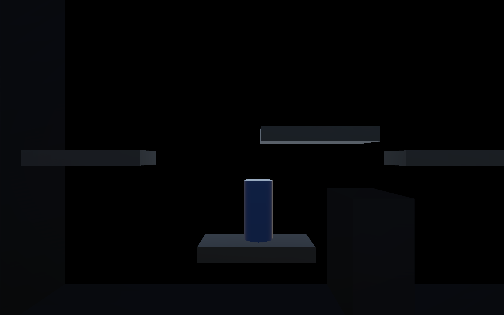
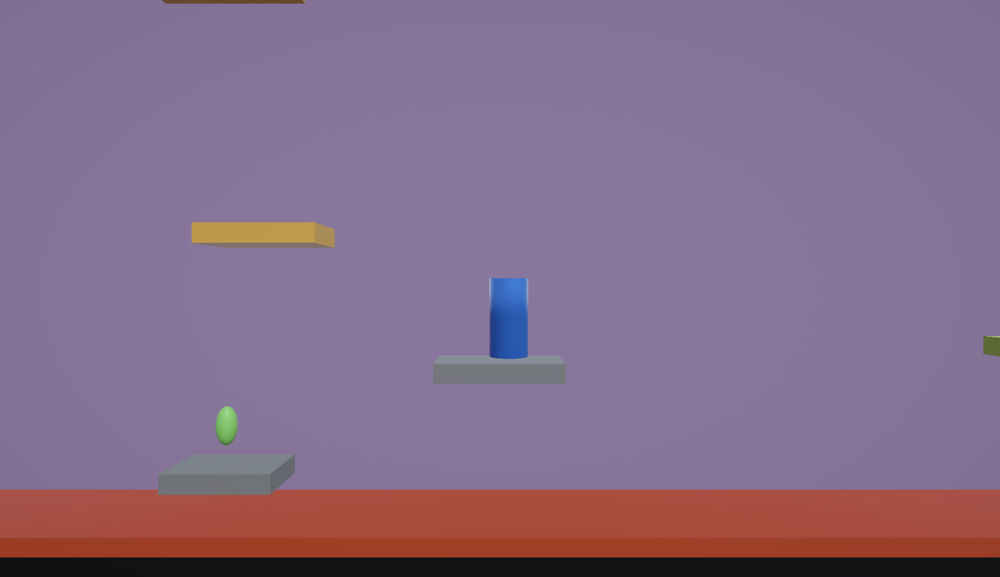

# Platformer Reflection - Ashlyn McClendon

### 0. Platformers Analysis 1: [View here](http://ashlyn-mcc.github.io/game-dev-spring2025/builds/platformer-1) 

### 1. Platformer Round 1: [Play here](http://ashlyn-mcc.github.io/game-dev-spring2025/builds/platformer-1) 

With is prototype I was just trying to get basic platformer controls implemented. I ended up adding double jump to my player's controls, the ability for the player to slow down in contact with water, and the ability for the player to change directions while jumping. With this iteration I learned how to manipulate the character controller to get the behaviors I wanted. I remember using character controllers in Game Dev, but I don't think I full understood them at the time.

### 2. Platformer Round 2 [Play here](http://ashlyn-mcc.github.io/game-dev-spring2025/builds/platformer-2)

With this prototype I wanted to take the controls I had implemented and create levels so the player had somewhere to apply the controls. I implemented horizontal and vertical moving platforms. These did not work particulalry well and the player had to fight to stay on them as they moved. I also added collectables and lava that respawns the player upon contact. The biggest piece of feedback I got was that it was too easy. There wasn't any real challenge. My levels weren't particularly showcasing the controls I had made. 

### 3. Platformer Final Round [Play here](http://ashlyn-mcc.github.io/game-dev-spring2025/builds/platformer-final)

For my final prototype I tried to do two things. 1) Fix my wonky platforms and 2) Make the level design feel intetional. While I wasn;t able to completely solve my moving platform problem, the player now slides much less while moving on the platforms. Instead of trying to make the player a child of the platform like I did in the previous version, I'm accounting for the platform's velocity so the player does not over-move in a direction. For the levels, I tried spacing the platforms out far horizontally. People who playtested my previous version noted that I had an (unintentional) coyote roll in my game, so I tried to create difficult platform jumps that utilized that feature. I expanded upon the current levels a bit so there's more to do, and tried to put the collectables in harder to reach places.