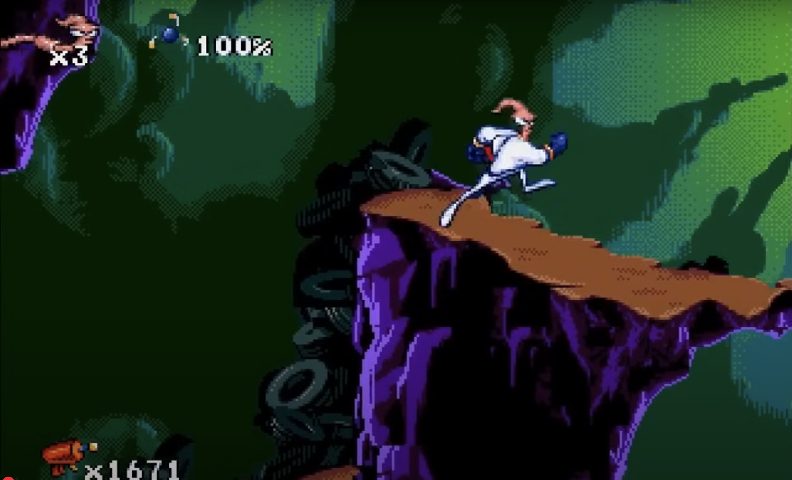
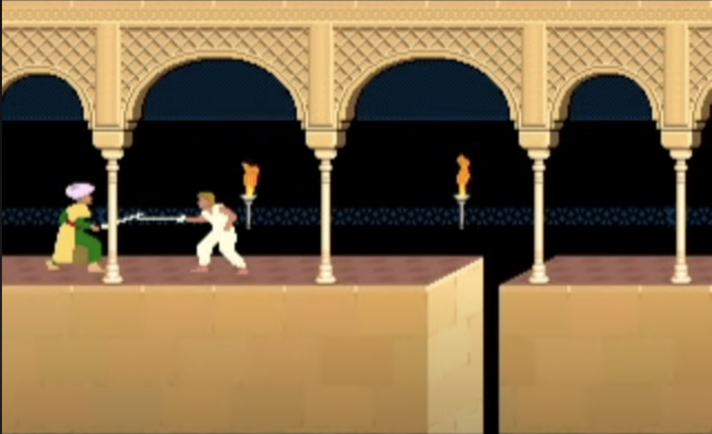

# Platformer Analysis Reflection - Ashlyn McClendon

### 1. Castlevania (1986): [Longplay](https://www.youtube.com/watch?v=lRcHk8ixyKE) 

**Ground movement:** There's gravity in the game. When you're walking on the ground and there's either a hole or step down, you automatically fall down. Similarly, if there's steps you automatically go up them. You don't need to jump. You stop moving on the ground when you use a weapon. When the player whips something they stand in one place. You can also duck in this game.

**Jump:** You can move while jumping. Many times in the longplay the player would jump while moving forward, and the forward movement would continue. You can only jump "one to two blocks" up. The max vertical jump distance feels like a balance between making sure the player can reach all platforms, but it must be done through a progression of small steps.

**Level Design:** The levels feel horizontally focused. By that I mean, there seems to be more depth to the level aong the x axis instead of the y axis. As you move off the right side of the screen you emerge from the left side at a new level. The levels include static and dynamic enemies -- some of which launch projectiles at the player. There's also many powerups scattered around that the player can whip to get.

### 2. Earthworm Jim (1994): [Longplay](https://www.youtube.com/watch?v=xhNv476tAs8) 

**Ground movement:** There's a few different kinds of movement you can do in this game. You can run on the ground, climb walls, and swing across ropes. I noticed that when the character is walking across hills (platforms with a steep incline) they automatically go up them. They don't have to jump. Similarly, when the walk across steep declines in the platform they automatically slide down. To me, there doesn't seem to me to be any cululation of forces or acceleration when walking. When the walking input is being received the character is moving at one speed and as soon as that input isn't being recieved the character immediately stops. 

**Jump:** The jumps in this game are very parabolic. It seems to me that you can control your player even in mid air. Sometimes in the long play the player would jump, and then about halfway through would drop straight down instead of completing an arc motion. I think this may be from the player stopping giving input to the joystick. Changing direction while in the middle of jumping isn't realistic, but I think it makes the gameplay more fun. Additionally in this game, if you miscalculate a jump and come up too short the player can grab onto the side of the platform and pull themselves up. They can also launch some sort of grappling hook mid jump and use it to propel themselves.

**Level Design:** This game has a very unique design. It's not particularly linear; everything feels freeform. Different levels highlight different aspects of game movement. Levels focsuing on jumping have small spaced out platforms with lots of ropes for swinging while levels focusing on running have long elevation varying platofrms. Each level has it's own visual theme and boss design. 

### 3. Prince of Persia (1989): [Longplay](https://www.youtube.com/watch?v=FGQmtlxllWY) 

**Ground movement:** When the player goes to stop moving there's a brief moment where the player seems to slow down before stopping. The other games I looked at felt more like an immediate stop. This game in general has much more fluid and realistic motion that other platformer's I've seen. You can also creep the player right up to the edge of things. Maybe this was just the person playing the longplay I watched, but frequenlty the player would get right up to the edge of dangerous obstacles without touching them.

**Jump:** The player can either jump straight up to grab onto something and pull themself up, or they can jump across gaps. The way the character is animated makes the movement of the jump seem real. There's a build up, the actual jump, and then a moment for the character to catch their balance after the jump.

**Level Design:** 

The player fights sworded enemies throughout the levels. There are vases in some of the levels the player can drink from to replenish their health. Pieces of the ground can break/ be broken. There are metal spikes the player has to duck under and jump between. The game will occasiionally remind the player of the end goal by flashing to the princess in the tower. 